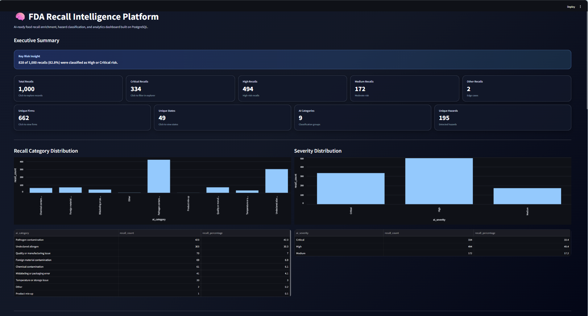

# FDA Recall Intelligence Platform

## Project Overview

The FDA Recall Intelligence Platform is an end-to-end data engineering and analytics project that extracts food recall data from the FDA openFDA API, cleans and loads the data into PostgreSQL, enriches each recall using a rule-based AI-ready classification engine, and presents insights through a Streamlit dashboard.

The goal of this project is to transform raw FDA recall records into structured intelligence that can help users understand recall patterns by hazard type, severity, category, state, firm, and time period.

---

## Why This Project Was Built

Raw recall data is useful, but it is not always easy to analyze directly. Recall reasons are stored as text, and important details such as hazard type, severity, and business category are hidden inside long descriptions.

This project solves that problem by building a pipeline that:

- Extracts recall data from the FDA API
- Cleans and standardizes the raw records
- Loads the data into PostgreSQL
- Classifies recall reasons into meaningful AI-ready categories
- Stores enrichment results in a separate database table
- Creates analytics views for reporting
- Displays insights in an interactive Streamlit dashboard

---

## Tech Stack

- Python
- PostgreSQL
- SQL
- Streamlit
- pandas
- psycopg2
- python-dotenv
- FDA openFDA API

---

## Project Architecture

```text
FDA openFDA API
    ↓
Python ingestion script
    ↓
Raw JSON files
    ↓
Python cleaning script
    ↓
Cleaned CSV
    ↓
PostgreSQL staging table
    ↓
Rule-based AI-ready enrichment
    ↓
PostgreSQL enrichment table
    ↓
Analytics SQL views
    ↓
Streamlit dashboard
```

---
---

## Dashboard Preview



## Data Pipeline

### 1. Data Extraction

The project extracts FDA food recall records from the openFDA food enforcement API.

The ingestion script saves the API response as raw JSON so the original source data is preserved before any cleaning or transformation happens.

### 2. Data Cleaning

The cleaning script standardizes and prepares the raw FDA recall records for loading into PostgreSQL.

Cleaning includes:

- Selecting useful fields from the raw FDA API response
- Normalizing text fields
- Converting FDA date values into SQL-friendly date format
- Removing duplicate recall numbers
- Writing cleaned records to CSV

### 3. PostgreSQL Loading

Cleaned recall records are loaded into the PostgreSQL staging table:

```text
stg_fda_recalls
```

This table stores the cleaned FDA recall data and acts as the trusted source table for downstream enrichment.

### 4. AI-Ready Enrichment

A rule-based classification engine analyzes each recall reason and assigns structured intelligence fields.

The enrichment process assigns:

- AI category
- Hazard type
- Hazard name
- Severity
- Confidence score
- AI-style summary
- Model/prompt version metadata

The enrichment output is stored in:

```text
ai_recall_enrichment
```

This design separates raw FDA recall data from enriched intelligence, which makes the project easier to audit, extend, and improve later.

---

## Enrichment Categories

The rule-based classifier assigns each recall into one of the following categories:

- Pathogen contamination
- Undeclared allergen
- Foreign material contamination
- Chemical contamination
- Mislabeling or packaging error
- Quality or manufacturing issue
- Temperature or storage issue
- Product mix-up
- Other

---

## Database Design

### Main Tables

```text
stg_fda_recalls
```

Stores cleaned FDA recall records.

```text
ai_recall_enrichment
```

Stores AI-ready enrichment results such as category, hazard type, hazard name, severity, confidence score, summary, model name, and prompt version.

### SQL Scripts

Database objects are documented in:

```text
db/01_create_tables.sql
db/02_create_views.sql
```

The table script contains the staging and enrichment table definitions.

The views script contains reusable analytics views used by the Streamlit dashboard.

---

## Analytics Views

The project includes reusable SQL views for dashboarding and reporting:

```text
vw_recall_enriched
vw_recall_kpi_summary
vw_recall_category_summary
vw_recall_severity_summary
vw_recall_hazard_summary
vw_recall_hazard_summary_total_pct
vw_recall_state_summary
vw_recall_monthly_trend
vw_recall_firm_summary
vw_recall_state_category_summary
```

These views make the dashboard simpler because most of the business logic is handled inside PostgreSQL instead of being repeated inside the Streamlit app.

---

## Streamlit Dashboard

The Streamlit dashboard provides an interactive interface for exploring FDA recall insights.

Dashboard features include:

- KPI cards
- Category distribution
- Severity distribution
- Top hazards
- Top states
- Monthly recall trend
- Top recalling firms
- Recall record explorer
- Filters by category, severity, and state
- Search by product, firm, reason, hazard, or recall number

The dashboard reads from PostgreSQL analytics views instead of performing all calculations directly in the app. This keeps the application cleaner and makes the database layer reusable.

---

## Final Dataset Summary

The project enriched 1,000 FDA food recall records.

### Enrichment Coverage

```text
Total records: 1000
Enriched records: 1000
Not enriched records: 0
Coverage: 100%
```

### Final Category Distribution

```text
Pathogen contamination:             423
Undeclared allergen:                303
Quality or manufacturing issue:      70
Foreign material contamination:      69
Chemical contamination:              61
Mislabeling or packaging error:      41
Temperature or storage issue:        30
Other:                                2
Product mix-up:                       1
```

### Final Severity Distribution

```text
Critical: 334
High:     494
Medium:   172
```

### Key Insight

828 out of 1,000 recalls were classified as High or Critical risk.

That means 82.8% of recall records in this sample were high-risk or critical based on the enrichment logic.

---

## Key Findings

- Pathogen contamination was the largest recall category.
- Undeclared allergens were the second-largest recall category.
- Listeria and Salmonella were the most common hazards.
- Milk and peanut were among the most common allergen hazards.
- California had the highest number of recall records in the 1,000-record sample.
- Only 2 records remained in the Other category after enrichment.

---

## How to Run the Project

### 1. Clone or open the project folder

Open the project folder:

```text
ai-fda-recall-platform
```

### 2. Create and activate a virtual environment

```powershell
python -m venv .venv
.\.venv\Scripts\Activate.ps1
```

### 3. Install dependencies

```powershell
pip install -r requirements.txt
```

### 4. Configure environment variables

Create a `.env` file in the project root using `.env.example` as a template.

Example:

```text
POSTGRES_HOST=localhost
POSTGRES_PORT=5432
POSTGRES_DB=fda_recall_ai
POSTGRES_USER=postgres
POSTGRES_PASSWORD=your_password_here
```

### 5. Create the PostgreSQL database

Create a local PostgreSQL database named:

```text
fda_recall_ai
```

Example:

```sql
CREATE DATABASE fda_recall_ai;
```

### 6. Create database tables

From the project root, run:

```powershell
psql -U postgres -d fda_recall_ai -f db/01_create_tables.sql
```

### 7. Run the data ingestion script

```powershell
python ingestion/extract_fda_recalls.py
```

This extracts FDA recall records from the openFDA API and saves the raw JSON file under:

```text
data/raw/
```

### 8. Run the data cleaning script

```powershell
python processing/clean_fda_recalls.py
```

This creates a cleaned CSV file under:

```text
data/processed/
```

### 9. Load cleaned data into PostgreSQL

Use PostgreSQL `\copy` from psql:

```sql
\copy stg_fda_recalls FROM 'C:/Users/neera/Documents/ai-fda-recall-platform/data/processed/fda_recalls_cleaned.csv' WITH (FORMAT csv, HEADER true, ENCODING 'UTF8');
```

Adjust the file path if your project is located somewhere else.

### 10. Run rule-based enrichment

```powershell
python enrichment/rule_based_enrichment.py
```

The enrichment script classifies recall records and inserts enrichment results into:

```text
ai_recall_enrichment
```

### 11. Create analytics views

```powershell
psql -U postgres -d fda_recall_ai -f db/02_create_views.sql
```

### 12. Run the Streamlit dashboard

```powershell
python -m streamlit run app/streamlit_app.py
```

The dashboard should open in the browser at a local URL such as:

```text
http://localhost:8501
```

---

## Project Folder Structure

```text
ai-fda-recall-platform/
    app/
        streamlit_app.py
    data/
        raw/
        processed/
    db/
        01_create_tables.sql
        02_create_views.sql
    enrichment/
        rule_based_enrichment.py
        preview_remaining_enrichment.py
    ingestion/
        extract_fda_recalls.py
    processing/
        clean_fda_recalls.py
        inspect_raw_data.py
    logs/
    .env.example
    .gitignore
    requirements.txt
    README.md
```

---

## Important Notes

- The project uses a 1,000-record FDA food recall sample.
- The rule-based classifier is designed to be AI-ready and can later be replaced or enhanced with an LLM.
- The raw FDA records and enriched intelligence are stored separately.
- PostgreSQL views are used to keep dashboard logic reusable and easier to maintain.
- The dashboard is built with Streamlit and reads directly from PostgreSQL analytics views.
- This project is intended as a practical data engineering and AI-enrichment portfolio project.

---

## Future Enhancements

Possible next improvements:

- Add OpenAI or another LLM-based enrichment process for ambiguous recall reasons
- Add embeddings and semantic search
- Add RAG-based recall question answering
- Add automated scheduled FDA API ingestion
- Add Power BI dashboard
- Add firm-name standardization
- Add data quality checks
- Add unit tests for enrichment rules
- Deploy the Streamlit dashboard
- Add user authentication for production use
- Add Docker support for easier setup

---

## Project Status

Current status:

```text
Data extraction: Complete
Data cleaning: Complete
PostgreSQL loading: Complete
Rule-based enrichment: Complete
Analytics views: Complete
Streamlit dashboard: Complete
README documentation: In progress
```